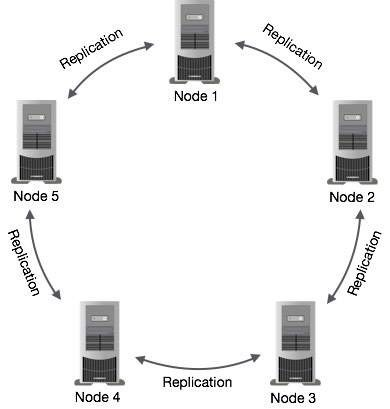
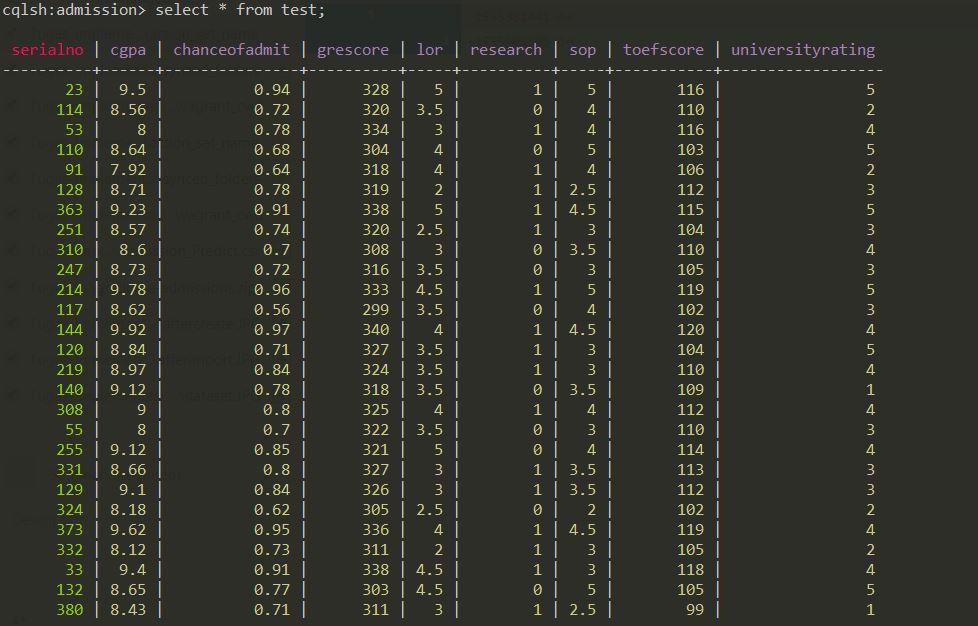
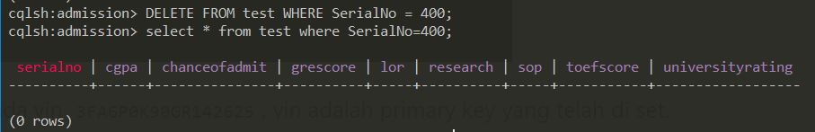

# 1. Implementasi Cassandra Single Node
# 1.1 Apa itu Cassandra?
Cassandra atau lengkap APACHE CASSANDRA adalah salah satu produk open source untuk menajemen database yang didistribusikan oleh Apache yang sangat scalable (dapat diukur) dan dirancang untuk mengelola data terstruktur yang berkapasitas sangat besar (Big Data) yang tersebar di banyak server. Cassandra merupakan salah satu implementasi dari NoSQL (Not Only SQL) seperti mongoDB. NoSQL merupakan konsep penyimpanan database dinamis yang tidak terikat pada relasi-relasi tabel yang kaku seperti RDBMS. Selain lebih scalable, NoSQL juga memiliki performa pengaksesan yang lebih cepat. Hal-hal itulah yang membuat NoSQL menjadi semakin populer beberapa tahun belakangan ini.
# 1.2 Perbedaan Antara Relasional dan NoSQL

# 1.3 Arsitektur
Konsep Replication Antar Node Cassandra

Gambar diatas menunjukkan bagaimana Cassandra menggunakan replikasi data antara node dalam sebuah cluster untuk memastikan tidak ada satu titik yang mengalami kegagalan.

### Cassandra mempunyai beberapa komponen utama yaitu :

Node : ini adalah server tempat penyimpanan data.<br />
Data Center : kumpulan dari beberapa node.<br />
Cluster : Kumpulan dari beberapa data center<br />
Commit Log : adalah log dari proses penulisan di Cassandra , yang berfungsi juga sebagai Crash Recovery Mechanism<br />
Mem-Table : Adalah memory-resident data structure. Setelah menulis dalam commit log , cassandra melakukan penulisan di sini<br />
CQL : Cassandra Query Language , adalah bahasa perintah query di cassandra .

# 1.4. Yang dibutuhkan untuk instalasi Cassandra
1. Vagrant
2. Ubuntu 14.04

# 1.5. Instalasi
1. Melakukan instalasi properties-common agar dapat melakukan add-repository
```
sudo apt-get update
sudo apt-get install software-properties-common
```
2. Kemudian menginstall Oracle Java Virtual Machine
```
sudo add-apt-repository ppa:webupd8team/java
sudo apt-get update
sudo apt-get install oracle-java8-set-default
```
3. Setelah itu install cassandra dengan package yang didapat dari repositori apache
```
echo "deb http://www.apache.org/dist/cassandra/debian 22x main" | sudo tee -a /etc/apt/sources.list.d/cassandra.sources.list
echo "deb-src http://www.apache.org/dist/cassandra/debian 22x main" | sudo tee -a /etc/apt/sources.list.d/cassandra.sources.list
```
4. Export key secara berurutan
```
gpg --keyserver pgp.mit.edu --recv-keys F758CE318D77295D
gpg --export --armor F758CE318D77295D | sudo apt-key add -

gpg --keyserver pgp.mit.edu --recv-keys 2B5C1B00
gpg --export --armor 2B5C1B00 | sudo apt-key add -

gpg --keyserver pgp.mit.edu --recv-keys 0353B12C
gpg --export --armor 0353B12C | sudo apt-key add -
```
Output penambahan key

5. Install cassandra
```
sudo apt-get update
sudo apt-get install cassandra
```
6. Mengecek apakah cassandra sedang berjalan
```
sudo service cassandra status
```


7. Mengecek status cluster
```1
sudo nodetool status
```

UN menandakan bahwa sedang hidup dan normal (Up and Normal)

# 1.6 Import Dataset dan CRUD
Dataset yang akan diimport adalah Graduate Admission yang didapatkan dari kaggle.com

https://www.kaggle.com/mohansacharya/graduate-admissions/version/2

# 1.6.1 Import
Sebelum melakukan CRUD kita akan melakukan import dataset:
1. Petama, lakukan login melalui cqlsh.
2. Lalu, Buat keyspace untuk tempat table import datasets
```
CREATE KEYSPACE admission
  WITH REPLICATION = { 
   'class' : 'NetworkTopologyStrategy', 
   'datacenter1' : 1 
  } ;
```
3. Setelah membuat keyspace masuk kedalam keyspace tersebut dengan cara:
```
use admission;
```
4. Karena csv tidak memiliki data type sehingga diperlukan melakukan pembuatan table sebelum melakukan importing csv.
```
CREATE TABLE test (SerialNo int,GREScore text,TOEFScore text,UniversityRating text ,SOP text,LOR text
,CGPA text,Research text,ChanceofAdmit text, PRIMARY KEY(SerialNo));
```
5. Lalu import file csv ke table test
```
COPY test (SerialNo,GRE_Score,TOEFScore,UniversityRating,SOP,LOR,CGPA,Research,ChanceofAdmit) FROM '/v agrant/Admission_Predict.csv' WITH DELIMITER = ',' AND HEADER = TRUE;
```


# 1.6.2 CRUD
### Select
```
SELECT * FROM test;
```


### Insert
```
INSERT INTO test(SerialNo) values(401);
```


### Delete
```
DELETE FROM test WHERE SerialNo = 400;
```



### Update
```
UPDATE test SET universityrating = '5' WHERE SerialNo = 401;
```

# 2. Implementasi Cassandra Multi Node
Pada bagian ini, kita akan melakukan implementasi multinode. Pertama, lakukan instalasi seperti node sebelumnya.
# 2.1. Yang dibutuhkan
Cassandra sudah diinstall di node 1 dan 2
# 2.2. Menghapus data default
Matikan service cassandra di semua node, kemudian hapus default dataset
```
sudo service cassandra stop
sudo rm -rf /var/lib/cassandra/data/system/*
```
# 2.3. Konfigurasi cluster
Buka file konfigurasi di kedua node
```
sudo nano /etc/cassandra/cassandra.yaml
```
dan ubah script yang ada di file tersebut menjadi seperti ini
```
. . .

cluster_name: 'CassandraDOCluster'

. . .

seed_provider:
  - class_name: org.apache.cassandra.locator.SimpleSeedProvider
    parameters:
         - seeds: "192.168.33.11,192.168.33.12"

. . .

listen_address: 192.168.33.1# (192.168.33.11, jika file konfigurasi di node1 dan 192.168.33.12, jika file konfigurasi di node2)

. . .

rpc_address: 192.168.33.1#

. . .

endpoint_snitch: GossipingPropertyFileSnitch

. . .
```
kemudian tambahkan script berikut pada line paling bawah di file konfiguras
```
auto_bootstrap: false
```

# 2.4. Konfigurasi firewall
Jalankan script berikut untuk menginstall Persistent Firewall Service.
```
sudo apt-get update
sudo apt-get install iptables-persistent
```
setelah install, maka semua konfigurasi firewall berada pada /etc/iptables/rules.v4 jika menggunakan IPv4 dan /etc/iptables/rules.v6 jika menggunakan IPv6.

Setelah itu edit file /etc/iptables/rules.v4 dan /etc/iptables/rules.v6. Buka file rules.v4:
```
sudo nano /etc/iptables/rules.v4
```
Kemudian ubah konten yang ada di file itu, menjadi:
```
*filter
# Allow all outgoing, but drop incoming and forwarding packets by default
:INPUT DROP [0:0]
:FORWARD DROP [0:0]
:OUTPUT ACCEPT [0:0]

# Custom per-protocol chains
:UDP - [0:0]
:TCP - [0:0]
:ICMP - [0:0]

# Acceptable UDP traffic

# Acceptable TCP traffic
-A TCP -p tcp --dport 22 -j ACCEPT

# Acceptable ICMP traffic

# Boilerplate acceptance policy
-A INPUT -m conntrack --ctstate ESTABLISHED,RELATED -j ACCEPT
-A INPUT -i lo -j ACCEPT

# Drop invalid packets
-A INPUT -m conntrack --ctstate INVALID -j DROP

# Pass traffic to protocol-specific chains
## Only allow new connections (established and related should already be handled)
## For TCP, additionally only allow new SYN packets since that is the only valid
## method for establishing a new TCP connection
-A INPUT -p udp -m conntrack --ctstate NEW -j UDP
-A INPUT -p tcp --syn -m conntrack --ctstate NEW -j TCP
-A INPUT -p icmp -m conntrack --ctstate NEW -j ICMP

# Reject anything that's fallen through to this point
## Try to be protocol-specific w/ rejection message
-A INPUT -p udp -j REJECT --reject-with icmp-port-unreachable
-A INPUT -p tcp -j REJECT --reject-with tcp-reset
-A INPUT -j REJECT --reject-with icmp-proto-unreachable

# Commit the changes
COMMIT

*raw
:PREROUTING ACCEPT [0:0]
:OUTPUT ACCEPT [0:0]
COMMIT

*nat
:PREROUTING ACCEPT [0:0]
:INPUT ACCEPT [0:0]
:OUTPUT ACCEPT [0:0]
:POSTROUTING ACCEPT [0:0]
COMMIT

*security
:INPUT ACCEPT [0:0]
:FORWARD ACCEPT [0:0]
:OUTPUT ACCEPT [0:0]
COMMIT

*mangle
:PREROUTING ACCEPT [0:0]
:INPUT ACCEPT [0:0]
:FORWARD ACCEPT [0:0]
:OUTPUT ACCEPT [0:0]
:POSTROUTING ACCEPT [0:0]
COMMIT
```

Kemudian edit file rules.v6:
```
sudo nano /etc/iptables/rules.v6
```
Ubah kontennya menjadi:
```
*filter
:INPUT DROP [0:0]
:FORWARD DROP [0:0]
:OUTPUT DROP [0:0]
COMMIT

*raw
:PREROUTING DROP [0:0]
:OUTPUT DROP [0:0]
COMMIT

*nat
:PREROUTING DROP [0:0]
:INPUT DROP [0:0]
:OUTPUT DROP [0:0]
:POSTROUTING DROP [0:0]
COMMIT

*security
:INPUT DROP [0:0]
:FORWARD DROP [0:0]
:OUTPUT DROP [0:0]
COMMIT

*mangle
:PREROUTING DROP [0:0]
:INPUT DROP [0:0]
:FORWARD DROP [0:0]
:OUTPUT DROP [0:0]
:POSTROUTING DROP [0:0]
COMMIT
```

Setelah mengubah file konfigurasi, buka kembali file rules.v4 dan tambahkan script berikut sebelum komen ```# Reject anything that's fallen through to this point```
```
-A INPUT -p tcp -s your_other_server_ip -m multiport --dports 7000,9042 -m state --state NEW,ESTABLISHED -j ACCEPT
```
Ubah 'your_other_server_ip' dengan ip node yang bukan sedang kita edit, misal ip node1 adalah 192.168.33.11 dan ip node2 adalah 192.168.33.12, maka saat mengedit file rules.v4 di node1 ganti 'your_other_server_ip' dengan 192.168.33.12, begitupun sebaliknya.

Setelah itu restart iptables
```
sudo service iptables-persistent restart
```

Setelah itu cek status nodetool
```
sudo nodetool status
```
Maka hasilnya adalah ini


# 3. Referensi
https://www.digitalocean.com/community/tutorials/how-to-install-cassandra-and-run-a-single-node-cluster-on-ubuntu-14-04<br />
https://www.digitalocean.com/community/tutorials/how-to-run-a-multi-node-cluster-database-with-cassandra-on-ubuntu-14-04<br />
https://www.digitalocean.com/community/tutorials/how-to-implement-a-basic-firewall-template-with-iptables-on-ubuntu-14-04<br />
https://medium.com/@danairwanda/pengenalan-cassandra-database-nosql-3d33a768a20<br />
https://docs.datastax.com/en/cql/3.3/cql/cql_reference/cqlshCopy.html<br />
https://www.kaggle.com/mohansacharya/graduate-admissions/version/2

