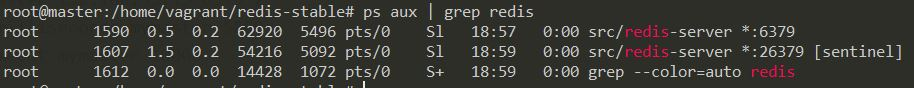

# IMPLEMENTASI REDIS
# 1.Model Arsitektur
  | IP Address | Hostname | Deskripsi |
  | --- | --- | --- |
  | 192.168.100.11 | master | Master(2G RAM)|
  | 192.168.100.12 | slave1 | Slave (1G RAM|
  | 192.168.100.13 | slave2 | Slave (1G RAM|
# 2.Instalasi
## 2.1 Install Redis
Pertama lakukan instalasi kebutuhan redis dimasing masing node :(hati-hati karna saat proses make sering terjadi error karena memori penuh. Untuk menghindari error, dapat mematikan node lain yang sudah diinstall redis terlebih dahulu).
```  
sudo apt-get update 
sudo apt-get install build-essential tcl
sudo apt-get install libjemalloc-dev  (Optional)
curl -O http://download.redis.io/redis-stable.tar.gz
tar xzvf redis-stable.tar.gz  
cd redis-stable
make
make test
sudo make install
```
## 2.2. Konfigurasi Redis
Pertama jalankan script berikut agar node lain dapat mengakses ip node tersebut
```
sudo ufw allow from 192.168.33.11
sudo ufw allow from 192.168.33.12  
sudo ufw allow from 192.168.33.13
```
Kemudian melakukan configurasi pada ```redis.conf``` dan ```sentinel.conf``` pada ```/home/vagrant/redis-cluster/``` pada master dan slave.
### Master
Edit redis.conf pada bagian berikut:
```
#bind 127.0.0.1 #commentkan pada bagian ini
protected-mode no #ubah yes menjadi no
port 6379 
logfile "/home/vagrant/redis-stable/redis.log" #tempat menyimpan redis-server log
```
Kemudian, edit sentinel.conf:
```
protected-mode no
port 26379
logfile "/home/vagrant/redis-stable/sentinel.log"
sentinel monitor mymaster 192.168.33.13 6379 2
sentinel down-after-milliseconds mymaster 5000
sentinel failover-timeout mymaster 10000
```
### Slave
Edit redis.conf pada bagian berikut:
```
#bind 127.0.0.1 #commentkan pada bagian ini
protected-mode no #ubah yes menjadi no
port 6379 
slaveof 192.168.33.10 637
logfile "/home/vagrant/redis-stable/redis.log" #tempat menyimpan redis-server log
```
Kemudian, edit sentinel.conf:
```
protected-mode no
port 26379
logfile "/home/vagrant/redis-stable/sentinel.log"
sentinel monitor mymaster 192.168.33.13 6379 2
sentinel down-after-milliseconds mymaster 5000s
sentinel failover-timeout mymaster 10000
```
# 3. Testing
Setelah melakukan instalasi, jalankan redis dengan menjalankan redis-server yang ada di folder src :
```
src/redis-server redis.conf &
src/redis-server sentinel.conf --sentinel &
```
Untuk melakukan check status jalankan ```ps aux | grep redis```:
<br/>
<br/>
<br/>

Jika semua sudah berjalan dengan baik isi pada ```redis.log``` kurang lebih seperti ini:
<br/>

Setelah itu melakukan testing dengan menjalankan ```redis-cli```, lalu set demokey pada master dengan teks "testing testing":<br/>
<br/>
lalu get demokey tersebut pada slave:<br/>
<br/>
<br/>

# 4. Failover
Saat master mati, maka slave akan menunjuk salah 1 master untuk menjadi master yang baru. Mematikan master dapat dilakukan dengan menjalankan ```redis-cli -p 6379 DEBUG SEGFAULT```:
<br/>
<br/>
# 5. Referensi
https://medium.com/@amila922/redis-sentinel-high-availability-everything-you-need-to-know-from-dev-to-prod-complete-guide-deb198e70ea6


